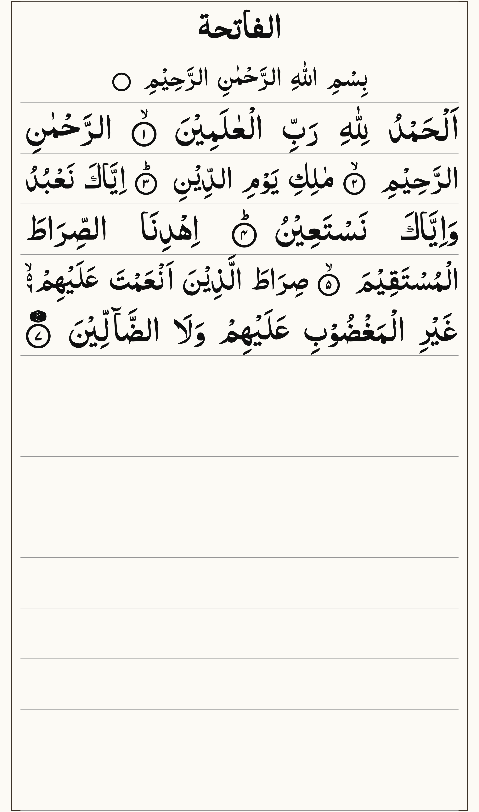
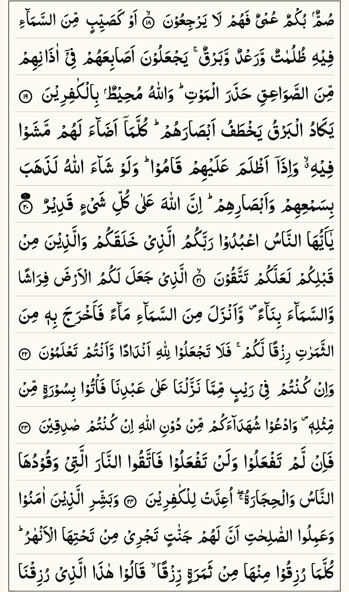
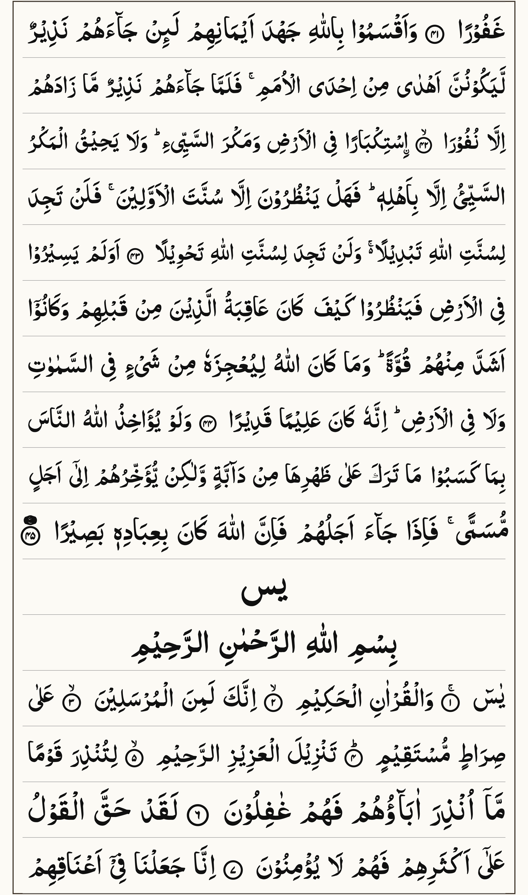
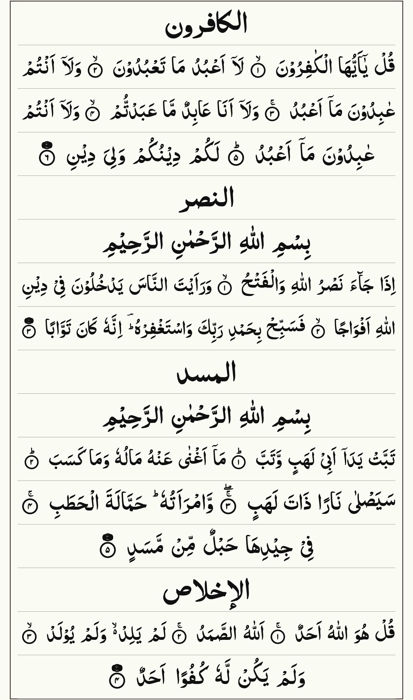
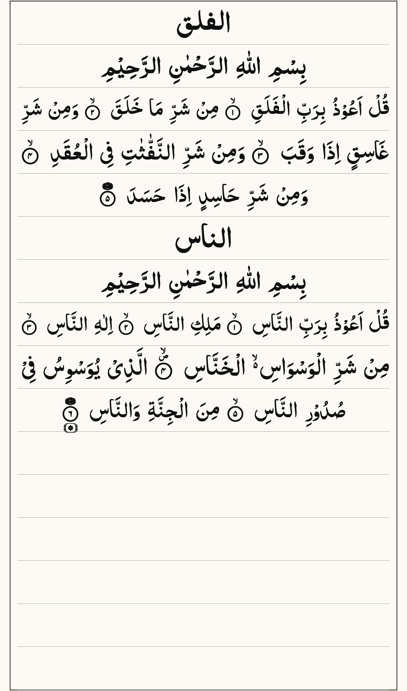

<h1 align="center">QURAN HD WITH AYAH COORDINATES</h1>

---

## About

This dataset was created as part of a personal project while attempting to build a consistent Quran text renderer using structured Indo-Pak Mushaf assets.

During development, rendering text directly across different devices caused inconsistent behavior and layout issues. To solve this, the final approach was to pre-render complete Quran pages and generate separate ayah coordinate data for interaction.

The result is this dataset, shared in case it helps reduce similar challenges for others.

---

## Source & Asset Credit

This dataset is based on structured Quran assets collected from multiple sources:

- Quran text data originally obtained from [qur.an.tarteel.ai](https://qur.an.tarteel.ai)
- Indopak word-by-word and layout assets available in:
  [legeRise/quran-indopak](https://github.com/legeRise/quran-indopak)

From that repository, the following assets were used:
- indopak-word-by-word.zip
- indopak-taj-company-16-line-layout.zip
- indopak-nastaleeq-font.zip

These assets were used as the base for rendering and layout alignment.

---

## Data Generation Process

A custom Python script was used to generate this dataset.

**Process overview:**

1. Load structured Quran text and layout assets
2. Apply 16-line Indo-Pak Mushaf formatting rules
3. Render full pages as images
4. Export pages at 2480 x 4200 resolution (WEBP format)
5. Generate ayah coordinate mappings for each page

---

## Folder Structure

After extracting the ZIP file:

```text
quran_by_para/
  para_01/
  para_02/
  ...
  para_30/
```

Each folder represents one Para (Juz).

---

## Inside Each Para

Each para folder contains sequential pages:

```text
para_01/
  page_001.webp
  page_001.json
  page_002.webp
  page_002.json
  ...
```

---

## Files

**WEBP:**
- Full Quran page image
- High resolution (2480 x 4200)

**JSON:**
- Ayah coordinate data for that page
- Used to map interaction regions

---

## Page Sequence

Pages are continuous across all paras:

para_01 starts from page 001  
para_30 ends at page 549

**Example:**

```text
para_30/
  page_548.webp
  page_548.json
  page_549.webp
  page_549.json
```

---

## Usage Idea

Each page contains both image and coordinate data, allowing:

- Reading the Quran in a structured Mushaf format
- Highlighting ayahs based on user interaction or audio sync
- Building consistent rendering across devices without layout issues

---

## Note

This is a personal project shared to help others who may face similar rendering challenges when working with structured Quran text and Indo-Pak layout systems.

---

## License / Usage

This dataset is shared for educational and development purposes.

Please ensure respectful handling of Quran content and proper attribution to original sources mentioned above.

---

## Sample Assets

Below are some sample page images from the dataset (see `sample-assets/`):

<div align="center">








</div>